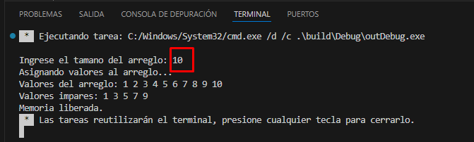
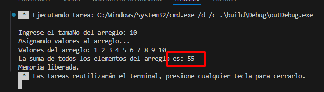
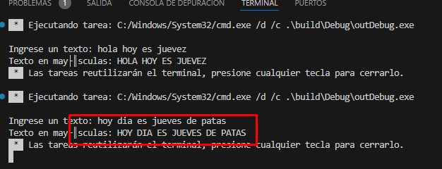
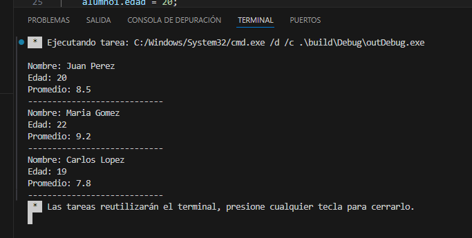

# GUÍA 3: Punteros en C++ 
## Curso:  PROGRAMACION 1
## Profesor : Marcio Fernando Merma Quispe
## Alumno: Efrain Vitorino Marin 
------------
# DESARROLLO DE LA PRACTICA
## *Asignación Dinámica de Memoria*
- Crea un puntero a un arreglo de enteros utilizando new, asigna valores a los
  elementos del arreglo y luego imprime los valores impares usando el puntero.
  No olvides liberar la memoria utilizando delete
* **1. Incluir librerías y declarar el espacio de nombres:**
    ```c++ 
    #include <iostream>
    using namespace std;
    ```
Esto incluye la librería `iostream` que permite la entrada y salida de datos y declara el uso del espacio de nombres estándar (`std`), para evitar tener que escribir `std::` antes de cada uso de elementos de la biblioteca estándar de `C++`.
  
  * **Declaración del puntero y asignación dinámica:**
     ```c++
     int* arreglo = new int[tamaño];
    ```
    * `int* arreglo:` Aquí `arreglo` es un puntero a un entero. Este puntero almacenará la dirección de la memoria donde comienza el arreglo dinámico.
    * `new int[tamaño]:` El operador `new` asigna memoria dinámica para un arreglo de enteros del tamaño especificado por tamaño. La dirección de la memoria asignada se almacena en el puntero arreglo.
 * **Acceso a los elementos del arreglo usando el puntero:**
    ```c++
    arreglo[i] = i + 1;
    ```
    * `arreglo[i]`: Aunque se usa la sintaxis de subíndice (que parece similar a un arreglo estático), en realidad, esta sintaxis está utilizando el puntero `arreglo`. En `C++`, el nombre del puntero a un arreglo se puede usar con la notación de subíndices para acceder a los elementos del arreglo. La expresión `arreglo[i]` es equivalente a `*(arreglo + i)`, donde `arreglo + i` es una dirección de memoria calculada sumando `i `al puntero base arreglo, y `* `desreferencia esa dirección para obtener el valor almacenado en ella.
 * **Liberación de la memoria dinámica:**
    ```c++
    delete[] arreglo;
    ```
    * `delete[] arreglo:` El operador `delete[]` libera la memoria que fue asignada dinámicamente para el `arreglo`. Esto asegura que no queden bloques de memoria sin utilizar, evitando fugas de memoria. `delete[]` es usado específicamente para liberar la memoria de arreglos asignados con `new[]`.
    ### EJEMPLO DE LA IMPLEMENTACION 
 ```C++
#include <iostream>
using namespace std;

int main() {
    int tamaño;

    // Pedir al usuario el tamaño del arreglo
    cout << "Ingrese el tamaño del arreglo: ";
    cin >> tamaño;

    // Crear un arreglo dinámico de enteros
    int* arreglo = new int[tamaño];

    // Asignar valores al arreglo
    cout << "Asignando valores al arreglo..." << endl;
    for (int i = 0; i < tamaño; ++i) {
        arreglo[i] = i + 1; // Llenando con números del 1 al tamaño (ejemplo)
    }

    // Imprimir todos los valores del arreglo
    cout << "Valores del arreglo: ";
    for (int i = 0; i < tamaño; ++i) {
        cout << arreglo[i] << " ";
    }
    cout << endl;

    // Imprimir valores impares del arreglo
    cout << "Valores impares: ";
    for (int i = 0; i < tamaño; ++i) {
        if (arreglo[i] % 2 != 0) {
            cout << arreglo[i] << " ";
        }
    }
    cout << endl;

    // Liberar la memoria asignada dinámicamente
    delete[] arreglo;
    cout << "Memoria liberada." << endl;

    return 0;
}
 ```
 #### PRUEBA DE SALIDA
 
## 2. Uso de Punteros en Funciones
Escribe una función que reciba un puntero a un arreglo de enteros y calcule la
suma de todos los elementos.

 * Incluimos la librería `iostream` para usar `cin` y `cout`.
   Usamos `namespace std` para evitar escribir `std::` repetidamente.
    * **Definición de la función `sumarElementos:`**
  
      `int* arreglo: ` Es un puntero a un arreglo de enteros.

       `int tamaño: ` Es el tamaño del arreglo.

       `int suma = 0; `: Inicializa una variable suma en 0.

      `for (int i = 0; i < tamaño; ++i): ` Itera a través de cada elemento del arreglo.

       `suma += arreglo[i]; `: Suma el valor de cada elemento del arreglo a suma.

       `return suma;`: Retorna la suma total.
       ```c++
        int sumarElementos(int* arreglo, int tamaño) {
            int suma = 0;
             for (int i = 0; i < tamaño; ++i) {
                suma += arreglo[i];
            }
            return suma;
        }
       ```
    * **Crear un arreglo dinámico de enteros:**
  
       `int* arreglo: ` Declaramos un puntero a un entero.

       `new int[tamaño]:` Asignamos dinámicamente memoria para un arreglo de enteros del tamaño especificado por el usuario.
    * **Asignar valores al arreglo:**
       `for (int i = 0; i < tamaño; ++i)`: Iteramos desde 0 hasta tamaño `- 1`.
       `arreglo[i] = i + 1;`: Asignamos el valor `i + 1` a cada elemento del arreglo
    ```c++
     cout << "Asignando valores al arreglo..." << endl;
     for (int i = 0; i < tamaño; ++i) {
          arreglo[i] = i + 1; // Llenando con números del 1 al tamaño (ejemplo)
     }
    ```
    * **Liberar la memoria asignada dinámicamente**
         ```c++
         delete[] arreglo;
         cout << "Memoria liberada." << endl;

         return 0;
         ```

### Ejemplo
```c++
#include <iostream>
using namespace std;

// Función que recibe un puntero a un arreglo de enteros y calcula la suma de todos los elementos
int sumarElementos(int* arreglo, int tamaño) {
    int suma = 0;
    for (int i = 0; i < tamaño; ++i) {
        suma += arreglo[i];
    }
    return suma;
}

int main() {
    int tamaño;

    // Pedir al usuario el tamaño del arreglo
    cout << "Ingrese el tamaNo del arreglo: ";
    cin >> tamaño;

    // Crear un arreglo dinámico de enteros
    int* arreglo = new int[tamaño];

    // Asignar valores al arreglo
    cout << "Asignando valores al arreglo..." << endl;
    for (int i = 0; i < tamaño; ++i) {
        arreglo[i] = i + 1; // Llenando con números del 1 al tamaño (ejemplo)
    }

    // Imprimir todos los valores del arreglo
    cout << "Valores del arreglo: ";
    for (int i = 0; i < tamaño; ++i) {
        cout << arreglo[i] << " ";
    }
    cout << endl;

    // Calcular la suma de los elementos del arreglo
    int suma = sumarElementos(arreglo, tamaño);
    cout << "La suma de todos los elementos del arreglo es: " << suma << endl;

    // Liberar la memoria asignada dinámicamente
    delete[] arreglo;
    cout << "Memoria liberada." << endl;

    return 0;
}
```
### Resultado


## 3. Paso de Parámetros por Referencia
Implementa una función que reciba un puntero a un string y modifique el
string (por ejemplo, convirtiendo todas las letras a mayúsculas o minúsculas).
Llama a esta función desde main para modificar un string y verifica el
resultado.
 * **Definición de la función `convertirMayusculas`:**
  
   `void convertirMayusculas(string* texto)`: La función recibe un puntero a un `string`.

   `for (size_t i = 0; i < texto->length(); ++i)`: Itera a través de cada carácter del `string`.

   `(*texto)[i] = toupper((*texto)[i]);`: Convierte cada carácter a mayúscula usando toupper y lo asigna de vuelta al `string`.

  ```c++
  void convertirMayusculas(string* texto) {
    for (size_t i = 0; i < texto->length(); ++i) {
        (*texto)[i] = toupper((*texto)[i]);
    }
  }
  ```
  ### Ejemplo 
```c++
#include <iostream>
#include <cctype>
using namespace std;

// Función que recibe un puntero a un string y convierte todas las letras a mayúsculas
void convertirMayusculas(string* texto) {
    for (size_t i = 0; i < texto->length(); ++i) {
        (*texto)[i] = toupper((*texto)[i]);
    }
}

int main() {
    string texto;

    // Pedir al usuario que ingrese un texto
    cout << "Ingrese un texto: ";
    getline(cin, texto);

    // Convertir el texto a mayúsculas usando la función
    convertirMayusculas(&texto);

    // Imprimir el texto modificado
    cout << "Texto en mayúsculas: " << texto << endl;

    return 0;
}

```
### Resultado

## 4. Definición y Manipulación Básica de Structs
Define una estructura Alumno que contenga campos como nombre (cadena de
caracteres), edad (entero) y promedio (flotante). Crea una variable de tipo
Alumno, asigna valores a los campos y luego imprime los valores
 * **Definición de la estructura `Alumno`**
  
   Esto define una nueva estructura llamada `Alumno` que contiene tres campos: `nombre`, `edad` y `promedio`.
   ```c++
   struct Alumno {
    string nombre;
    int edad;
    float promedio;
   };
   ```
* **Declaración y Asignación**
  
  Aquí se declara una variable `alumno1` de tipo `Alumno` y se inicializan sus campos.
   ```c++
     Alumno alumno1;
     alumno1.nombre = "Juan Pérez";
     alumno1.edad = 20;
     alumno1.promedio = 8.5f;
   ```
* **Declaración de un Puntero y Asignación de Dirección**
   
   Se declara un puntero `alumnoPtr` de tipo `Alumno*` y se le asigna la dirección de `alumno1`
    ```
    Alumno* alumnoPtr = &alumno1;
   ```
* **Modificación a través del Puntero**
  
  Se usan las flechas `->` para acceder y modificar los campos de `alumno1` a través del puntero `alumnoPtr`.
  ```c++
  alumnoPtr->nombre = "Juan Pérez Modificado";
  alumnoPtr->edad = 21;
  alumnoPtr->promedio = 9.0f;
  ```
* **Impresión a través del Puntero**
  
  Se llama a la función `imprimirAlumno` pasando el puntero alumnoPtr, que imprime los valores actualizados.

   ```c++
   imprimirAlumno(alumnoPtr);
   ```
   ## Ejemplo
```c++
#include <iostream>
#include <string>

using namespace std;

// Definición de la estructura Alumno
struct Alumno {
    string nombre;
    int edad;
    float promedio;
};

// Función para imprimir los detalles de un alumno
void imprimirAlumno(const Alumno& alumno) {
    cout << "Nombre: " << alumno.nombre << endl;
    cout << "Edad: " << alumno.edad << endl;
    cout << "Promedio: " << alumno.promedio << endl;
    cout << "----------------------------" << endl;
}

int main() {
    // Declaración y asignación de valores a varias variables de tipo Alumno
    Alumno alumno1;
    alumno1.nombre = "Juan Perez";
    alumno1.edad = 20;
    alumno1.promedio = 8.5f; // Definiendo un valor de tipo float

    Alumno alumno2;
    alumno2.nombre = "Maria Gomez";
    alumno2.edad = 22;
    alumno2.promedio = 9.2f; // Definiendo un valor de tipo float

    Alumno alumno3;
    alumno3.nombre = "Carlos Lopez";
    alumno3.edad = 19;
    alumno3.promedio = 7.8f; // Definiendo un valor de tipo float

    // Impresión de los valores de los campos de cada alumno
    imprimirAlumno(alumno1);
    imprimirAlumno(alumno2);
    imprimirAlumno(alumno3);

    return 0;
}
```
 ## Resultado 
 
 ## Gracias 